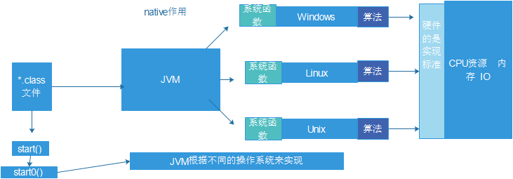
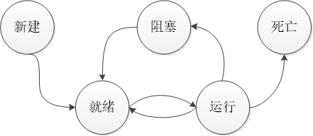

# 第二周-学习总结(2018.07.16 ~ 2018.07.22)

[TOC]

## 课程学习内容
### 07.16 面向对象
* 代码块: 使用{}括起来的代码成为代码块
    * 静态代码块: 在类中的成员位置，用{}括起来的代码，只不过它用static修饰
    * 构造代码块: 在类中的成员位置，用{}括起来的代码。每次调用构造方法执行前，都会先执行构造代码块。可以把多个构造方法的共同代码放在一起
    * 局部代码块: 局部位置，用于限定变量的生命周期
* 静态代码块、构造代码块、构造方法的执行顺序
    * 静态 -> 构造代码块 -> 构造方法
    * 静态代码块：只执行一次
* `this` 与 `super` 的区别

    |比较项|`this`|`super`|
    |:-|:-|:-|
    |定义|本类对象|父类对象|
    |使用|本类属性、方法、对象|父类属性、方法|
    |查找范围|先从本类查找，找不到去父类查找|直接去父类查找|
    |特殊点|`this`代表当前对象||
* `static` 关键字
    * static保存的位置在全局数据区中也叫类空间中
    * 在静态方法中不允许调用非静态方法或非静态全局变量
* `final` 关键字: 在Java中表示终结器的概念，可以定义类、方法及属性，被`final`修饰的类不能被继承、修饰方法不能被覆写、修饰属性不能被修改（常量）
* 方法的多态
    * 方法的重载
    * 方法的覆写: 名称、参数类型及个数、返回值与父类完全相同，访问权限不能比父类更严格
* 对象的多态
    * 向上转型: 统一标准，使用的方法向父类对齐
    * 向下转型: 子类可以使用自己独特的方法
    * 限制：向下转型必须先向上转型（即创建时发生了自动向上转型）
* `instanceof` 关键字: 判断某个对象是否是其或其子类的实例
* 抽象类: 使用关键字 `abstract`
    * 抽象类不能进行实例化操作
    * 抽象类存在构造方法，因为会被继承，子类在创建实例时会调用父类的构造方法
    * 抽象类不能定义为`final`，它需要子类继承
    * 抽象类中可以只存在普通方法，没有抽象方法
    * 抽象类中可以有静态属性和方法
    * 抽象类的缺点: 受限于Java的单继承、普通类继承抽象类必须覆写所有抽象方法
    * 应用: 模板设计模式
* 接口: 使用关键字 `interface`
    * 定义: 由全部都是抽象方法和全局变量组成的类，1.8以后支持 __默认方法__，可以不实现
    * 作用: 
        * 定义标准
        * 代表能力(行为)
        * 对完暴露的方法
    * 接口允许多继承，一个类可以实现多个接口
    * 抽象类和接口的区别

    |比较项|抽象类|接口|
    |-|-|-|
    |定义|`abstract`|`interface`|
    |组成|普通方法、抽象方法、构造方法和普通属性|抽象方法、全局常量及默认方法|
    |访问权限|public/protected/private|public|
    |关系|一个类能继承一个抽象类|一个类可以实现多个接口|
    |使用|`extends`|`implements`|
    |特殊点||一个接口可以继承多个接口|
* 工厂设计模式: 类与类之间是存在依赖关系的，依赖关系造成耦合度提高，实现解耦的方式就是使用工厂模式
    ```java
    public class TestFactory {
        public static void main(String[] args) {
            Fruit f = FruitFactory.getInstance(args[0]);
            if(f!=null) {
                f.eat();
            } else {
                System.out.println("The fruit is not exists...");
            }
        }
    }
    interface Fruit {
        public void eat();
    }
    class Apple implements Fruit {
        @Override
        public void eat() {
            System.out.println("eat apple...");
        }
    }
    class Pear implements Fruit {
        @Override
        public void eat() {
            System.out.println("eat pear...");
        }
    }
    class FruitFactory {
        public static Fruit getInstance(String name) {
            switch(name) {
                case "apple":
                    return new Apple();
                case "pear":
                    return new Pear();
                default:   
                    return null;
            }
        }
    }
    ```

### 07.17 包装类、异常、包访问权限
* 包装类([附`Integer`源码](../course/0717/Integer.java))
    * 装箱(基本->包装): `Integer x = new Integer(5);`
    * 拆箱(包装->基本): `int n = x.intValue();`
    * 在JDK1.5之前，必须使用如上方式装箱、拆箱，在JDK1.5之后，添加了 __自动拆箱和自动装箱__ 的操作
    ```java
    Integer x = 5;
    int n = x;
    ```
    * 包装类与`String`类似，具有对象池的概念
    * 数据转型: 将字符串转换为基本数据类型
        * 调用方法: `Integer.parseInt(s)`
        * 出现异常: if the String does not contain a parsable int, 会抛出`NumberFormatException`异常
* 异常处理
    * 异常处理的一般结构
    ```java
    try{
        // 可能会出现异常的代码
    } catch (NullPointerExcetion e) { // 声明具体的异常类型
        // 对 NullPointerExcetion异常的处理
    } catch(Exception e) { // 可以多层catch异常
        // 对 Exception异常的处理
    } finally {
        // 无论程序正常运行、出现异常或被打断
        // 都一定会执行的代码段
    }
    ```
    * 异常的继承结构
        * `Throwable`
            * `Error`: 表示JVM程序出错，不能被处理的异常
            * `Exception`: 程序中的异常，可以被处理
    * `throws`关键字: 作用于方法，将异常交给调用处处理
    * `throw`关键字: 作用于程序中，抛出某种异常，程序检测到某种异常，需要被处理
    * 注意: 只能在代码中忽略(不处理)`RuntimeException(及其子类)`类型的异常，编译器强制要求对其他类型的处理。
        * 无法预估的错误，比如传递了一个null引用
        * 代码中的错误，比如数组越界
    * 自定义异常
* 包
    * 使用包的目的: 为文件进行分离，相当于操作系统中的文件夹
    * 定义包: `package *(反顺序域名).*(项目名称).*(层次名)`
    * 导入包: 
        * `import *(包名).*(类名)` 
        * `import *(包名).*` 导入该包下所有类
        * 在使用中可以使用全名直接使用该类(一般为解决同名冲突使用)，如`java.util.ArrayList list = new java.util.ArrayList();`
    * 包的访问权限

    ||`public`|`default`|`protected`|`private`|
    |:-:|:-:|:-:|:-:|:-:|
    |本类|✔|✔|✔|✔|
    |同一包的不同类|✔|✔|✔|✘|
    |不同包的子类|✔|✔|✘|✘|
    |不同包的非子类|✔|✘|✘|✘|
    * 命名规范: 反顺序的域名.项目名

### 07.18 常用的工具类
* `StringBuilder` 和 `StringBuffer`(同时继承于`AbstractStringBuilder`)
    * `StringBuilder`线程不安全，如果局部使用，不存在多线程访问，不会有问题，速度较快
    * `StringBuffer`线程安全，在所有添加方法上使用了`synchronized`关键字
    * 实例:
    ```java
    class A extends Thread {
        private StringBuilder builder;
        private StringBuffer buffer;
        public A(StringBuilder builder, StringBuffer buffer) {
            this.builder = builder;
            this.buffer = buffer;
        }
        public void run() {
            for(int i=0; i<100; i++) {
                builder.append('d');
                buffer.append('d');
                try {
                    Thread.sleep(10);
                } catch(InterruptedException e) {
                    e.printStackTrace();
                }
            }
            System.out.println("[" + Thread.currentThread().getName() + "] builder:" + builder.length());
            System.out.println("[" + Thread.currentThread().getName() + "] buffer:" + buffer.length());
        }
        public static void main(String[] args) {
            // 测试，多线程同时向 builder 和 buffer 中拼接字符串，最终查看拼接长度
            StringBuilder builder = new StringBuilder();
            StringBuffer buffer = new StringBuffer();
            for(int i=0; i<10; i++) {
                new A(builder, buffer).start();
            }
        }
    }
    ```
* `Runtime`: 是一个单例，需要通过`getRuntime()`获取实例
    * `maxMemory()`: 获取JVM最大可用空间。Returns the maximum amount of memory that the Java virtual machine will attempt to use.
    * `totalMemory()`: 获取当前JVM的总空间。Returns the total amount of memory in the Java virtual machine.
    * `freeMemory()`: 获取当前JVM的空闲空间。Returns the amount of free memory in the Java Virtual Machine.
    * `gc()`: 显式调用gc开始工作。Runs the garbage collector.
* `System`: 系统类
    * `in`: The "standard" input stream.
    * `out`: The "standard" output stream.
    * `err`: The "standard" error output stream.
    * `arraycopy()`: Copies an array from the specified source array, beginning at the specified position, to the specified position of the destination array.
    * `currentTimeMillis()`: Returns the current time in milliseconds.
    * `exit()`: Terminates(终止) the currently running Java Virtual Machine.
    * `getenv()`: 获取系统环境变量，可以指定获取或全部获取。Returns an unmodifiable string map view of the current system environment. | Gets the value of the specified environment variable.
* `Date`: 日期类
* `SimpleDateFormat`: 日期格式化
    * `Date`格式化为字符串: `format()`
    * 字符串格式化为`Date`: `parse()`
* `Random`: 随机数
* `UUID`: 随机字符串
* `Math`: 数学工具类
* `BigInteger`: 大整数
* `BigDecimal`: 对超过16位有效位(小数点后16位)的数进行精确运算
* `Comparable`: 比较器接口，在类内部实现
* `Comparator`: 比较器接口，在类外部实现
* `Cloneable`: 对象克隆，覆写`clone()`方法，并提升访问权限

### 07.20 多线程和lambda表达式
#### 进程与线程的区别
线程是在进程的基础上进一步划分，一个进程可以存在多个线程，而线程是可以同步运行的

#### 多线程的优点
效率高: 可以最大限度的利用CPU的空闲资源，比如一遍编辑文档，一边打印文档中的内容

#### 如何使用多线程
* 继承`Thread`类，在Java中编写多线程程序的时候必须存在一个线程的主体类，而这个主体类只要继承了`Thread`类，并覆写`run()`方法就可以完成多线程的功能
    ```java
    class ThreadDemo extends Thread {
        @override
        public void run() {
            System.out.println("Hello multi-thread...");
        }
    }
    /** 测试方法 */
    ThreadDemo thread = new ThreadDemo();
    thread.start();
    ```
* 实现`Runnable`接口，主体类实现`run()`方法，并使用主体类构造`Thread`类。
    ```java
    /** 测试方法，Runnable使用lambda实现 */
    Runnable runnable = () -> {
        try {
            Thread.sleep(1000);
        } catch (InterruptedException e) {
            e.printStackTrace();
        }
        System.out.println("over");
    };
    new Thread(runnable).start();
    ```
* 实现`Callabel`接口，主体类实现`call()`方法，并使用主体类构造`FutureTask`类，最后将`FutureTask`类用于构造`Thread`类。在实现多线程的同时，可以接收返回结果，返回结果由`FutureTask`调用`get()`获取。
    ```java
    class MyThread implements Callable<String> {
        @Override
        public String call() throws Exception {
            for(int i=0; i<10; i++) {
                System.out.println("running " + i);
            }
            Thread.sleep(2000);
            return "over";
        }
    }
    /** 测试程序 */
    FutureTask<String> ft = new FutureTask<String>(new MyThread());
    new Thread(ft).start();
    System.out.println(ft.get()); // 会阻塞进程，等待线程返回
    ```

#### `start()`和`run()`启动线程的区别
`run()`方法不能真正启动一个线程，而只是单纯的运行了`run()`方法中的代码，而想要真正启动一个线程，需要调用`start()`方法。
* 测试例:
    ```java
    Runnable run1 = () -> {
        while(true)
            System.out.println("hhhhhhhhh");
    };
    Runnable run2 = () -> {
        while(true)
            System.out.println("ggggggggg");
    };
    new Thread(run1).run();
    new Thread(run2).run(); // 顺序执行，由于死循环使得本语句不会被执行

    // new Thread(run1).start();
    // new Thread(run2).start(); // 两线程争夺CPU，随机执行
    ```
* `start()`方法的源码
    ```java
    public synchronized void start() {
        /**
         * This method is not invoked for the main method thread or "system"
         * group threads created/set up by the VM. Any new functionality added
         * to this method in the future may have to also be added to the VM.
         *
         * A zero status value corresponds to state "NEW".
         */
        if (threadStatus != 0)
            throw new IllegalThreadStateException();

        /* Notify the group that this thread is about to be started
         * so that it can be added to the group's list of threads
         * and the group's unstarted count can be decremented. */
        group.add(this);

        boolean started = false;
        try {
            start0();
            started = true;
        } finally {
            try {
                if (!started) {
                    group.threadStartFailed(this);
                }
            } catch (Throwable ignore) {
                /* do nothing. If start0 threw a Throwable then
                  it will be passed up the call stack */
            }
        }
    }
    ```
    * 可以发现`start()`方法仅能被调用一次，多次调用会抛出`IllegalThreadStateException`异常
    * `start()`会将本线程加入线程组，并调用本地系统函数`start0()`
    * 线程进入就绪状态，只要获得CPU分配的时间片就可以开始执行
    * 流程如下图
    

#### 使用Runnable有优势
* 避免Java单继承的局限
* 更好地实现资源共享，多线程处理同一资源

#### lambda表达式
* 简介: 在JDK1.8之后增加的新特性，通过`lambda`表达式实现函数式编程
* 要求: 一个接口或一个类只有一个抽象方法
* 用法实例:
    ```java
    interface Print {
        // 有参无返回值
        public void print(String msg);
    }
    interface Calc {
        // 有参有返回值
        public int add(int a, int b);
    }
    interface IMessage {
        // 无参无返回值
        public void send();
    }
    public class TestLambda {
        public static void main(String[] args) {
            // 有参无返回值(只有一行函数体时可以省略{})
            Print print = (String msg) -> System.out.println(msg);
            // 有参有返回值
            Calc calc = (int a, int b) -> {
                return a + b;
            };
            IMessage msg = () -> {
                System.out.println("send message...");
            };
            
            print.print("有参无返回值");
            System.out.println(calc.add(1, 2));
            msg.send();
        }
    }
    ```
#### Callable接口与Runnable接口的区别？
* `Callable`可以返回一个泛型，而`Runnable`无返回值
* `Callable`可以抛出`Exception`异常，而`Runnable`不可以
* `Runnable`从1.0就有了，而`Callable`在1.5之后才出现
* `Runnable`和`Callable`都可用于`Executors`，但`Thread`仅支持`Runnable`

#### 线程的状态
1. __新建(New)__ 线程刚刚创建，分配系统资源
2. __就绪(Runnable)__ 新建后的线程已获得运行所需的系统资源，经`start()`调用后进入此状态，或被阻塞的线程停止阻塞，或者运行状态的线程用完了CPU分配给其时间片
3. __运行(Running)__ 就绪状态的线程获得CPU分配的时间片进入此状态
4. __阻塞(Block)__ 由于`sleep()`或`wait()`或`I/O`或同步锁的原因运行中的线程进入阻塞状态
5. __死亡(Dead)__ 线程运行完毕或因异常导致退出执行函数


#### 线程的常用操作
* 线程的命名与取得
    * 取得当前线程的方法: `public static native Thread currentThread();`
    * 命名
        * 构造方法设置: `public Thread(String name)` | `public Thread(ThreadGroup group, String name)` | `public Thread(Runnable target, String name)` | `public Thread(ThreadGroup group, Runnable target, String name)` | `public Thread(ThreadGroup group, Runnable target, String name, long stackSize)`
        * `public final void setName(String name);`
    * 获取线程名: `public final String getName();`
* 线程的休眠
    * `public static native void sleep(long millis) throws InterruptedException;`
    * `TimeUnit.SECCOND(还有其他单位).sleep(long timeout)`
* 线程的中断
    * 检测是否被中断: `public static boolean interrupted()` | `public boolean isInterrupted()`
    * 发起中断: `public void interrupt()`
    * 检测是否处于中断状态并修改状态位: `private native boolean isInterrupted(boolean ClearInterrupted);`
* 线程的强制执行
* 线程的礼让
* 线程的优先级


### 07.21 


## 自学内容
### 注解
#### 元注解: 专职负责注解其他的注解
* `@Target`: 表示该注解可以用于什么地方，可用的ElementType参数包括：
    * `CONSTRUCTIOR`: 构造器的声明
    * `FIELD`: 域声明(包括enum实例)
    * `LOCAL_VARIABLE`: 局部变量声明
    * `METHOD`: 方法声明
    * `PACKAGE`: 包声明
    * `PARAMETER`: 参数声明
    * `TYPE`: 类、接口(包括注解类型)或enum声明
* `@Retention`: 表示需要在级别保存该注解类型，可选的RetetionPolicy参数包括：
    * `SOURCE`: 注解将被编译器丢弃
    * `CLASS`: 注解在class文件中可用，但会被VM丢弃
    * `RUNTIME`: VM将在运行期也保留注解，因此可以通过反射机制读取注解的信息

#### 注解元素: 注解元素可用的类型如下
* 所有的基本数据类型(int, float, boolean等)(不允许使用包装类)
* `String`
* `Class`
* `enum`
* `Annotation`
* 以上类型的数组

#### 定义一个注解，并设置默认值
```java
@Target(ElementType.METHOD)
@Retention(RetetionPolicy.RUNTIME)
public @interface @SimulatingNull{
    public int id() default -1;
    public String description() default "";
}
```

#### 用法
 如果注解中仅有一个元素无默认值（需要赋值），此时无需使用名-值对的这种语法

#### 实例
```java
/**
 * 模拟JUnit实现单元测试
 */
@Target(ElementType.METHOD)
@Retention(RetentionPolicy.RUNTIME)
@interface Test {}

/**
 * @Test注解处理器
 */
class TestProcessor {
    public static void process(Class cl) {
        try {
            Object obj = cl.newInstance();
            for(Method method: cl.getDeclaredMethods()) {
                // System.out.println("--> "+method.getName());
                Annotation[] anns = method.getDeclaredAnnotations();
                if(anns.length < 1)
                    continue;
                if(anns[0] instanceof Test) {
                    System.out.println("==== [Testing]: " + method.getName() + " ====");
                    try {
                        method.invoke(obj);
                    } catch (java.lang.reflect.InvocationTargetException e) {
                        e.printStackTrace();
                    }
                }
            }

            System.out.println("==== you have passed this test. ====");
        } catch(InstantiationException|IllegalAccessException e) {
            e.printStackTrace();
        }
    }
}
class NeedTest {
    @Test
    public void run() {
        System.out.println("I'm running my Test...");
    }
}
public class Client {
    public static void main(String[] args) {
        TestProcessor.process(NeedTest.class);
    }
}
```


### 并发
#### 接口`Runnable`和类`Thread`的区别
* `Runnable -> run()`: 不是有单独的线程驱动的，需要依托其他线程
* `Thread -> run()`: 具有自己的线程

#### 使用`Executor`进行线程管理
* 不占用当前启动线程的资源
* 程序会在调用`shutdown()`之前提交的所有任务完成后结束
* `ExecutorService`:
    * `CachedThreadPool`: 为每一个任务创建一个线程(一般用这个就好)
    * `FixedThreadPool`: 可以控制线程的数量
    * `SingleThreadPool`: 仅有一个线程，类似线程数量为1的`FixedThreadPool`
    * 范例：
    ```java
    class LiftOff implements Runnable {
        private static int taskCount = 0;
        private final int id = taskCount++;
        @Override
        public void run() {
            for(int i=0; i<10; i++)
                System.out.println("["+id+"]("+Thread.currentThread().getId()+") " + i);
        }
        public static void main(String[] args) {
            ExecutorService exec = Executors.newCachedThreadPool();
            // ExecutorService exec = Executors.newFixedThreadPool(3); // 使用有限的线程集完成并发
            for(int i=0; i<5; i++)
                exec.execute(new LiftOff());
            // 防止新任务被提交给这个Executor
            exec.shutdown();
        }
    }
    ```

#### 线程的一些基本操作
* 休眠: `Thread.sleep(milliseconds)`: 休眠一段时间，参数为毫秒
* 优先级
    * 查看优先级: `Thread.currentThread().getPriority()`
    * 设置优先级: `Thread.currentThread().setPriority()`
    * 参数
        * `Thread.MAX_PRIORITY` 最高(10)
        * `Thread.NORM_PRIORITY` 中等(5)
        * `Thread.MIN_PRIORITY` 最低(1)
    * 注意: 尽管JDK有10个优先级，但它与多数操作系统都不能映射得很好。比如Windows7有7个优先级且不固定，所以这种映射关系也不是确定的。唯一可移植的方法是当调整优先级别的时候，只使用`MAX_PRIORITY`、`NORM_PRIORITY`和`MIN_PRIORITY`三种级别。
* 让步: 使用`Thread.yeild()`进行暗示，申请可以将资源调度给其他线程使用，但系统未必会切换线程 
* 后台线程
    * 程序在运行时在后台提供一种通用服务的线程，并且这种线程并不属于程序中不可或缺的部分
    * 当所有的非后台线程结束后，程序也就终止了，同时会杀死所有后台进程
    * 将线程设置为后台线程需要在线程启动前设置`thread.setDaemo(true)`
* 加入一个线程: 如果在某个线程`x`中让线程`t`上调用`t.join()`，线程`x`将被挂起，直到线程`t`结束才恢复（即i`t.isAlive()`返回为`false`）。对`t.join()`方法的调用可以被中断，做法为调用`x.interrupt()`。如果线程`x`被中断或正常结束，线程`t`也将和`x`一同结束
* 在线程中捕获异常，默认会向外传播到外层
    * 使用`Executor`来管理线程的创建，在每个创建时附上一个异常处理器`Thread.UncaughtExceptionHandler`
    ```java
    /** 测试方法 */
    public static void main(String[] args) {
        ExecutorService exec = Executors.newCachedThreadPool(new CacheExceptionThreadFactory());
        exec.execute(new Thread() {
            @Override
            public void run() {
                System.out.println("R线程名: " + getId());
                System.out.println("R: " + currentThread().getUncaughtExceptionHandler().toString());
                throw new RuntimeException("给你个异常瞧瞧");
            }
        });
        exec.shutdown();
    }
    /** 异常处理器 */
    class myUncaughtExceptionHandler implements Thread.UncaughtExceptionHandler {
        public void uncaughtException(Thread t, Throwable e) {
            System.out.println("E线程名: " + t.getId() + "异常: " + e.getMessage());
        }
        @Override
        public String toString() {
            return "哈哈"+super.toString();
        }
    }
    /** 线程生成工厂 */
    class CacheExceptionThreadFactory implements ThreadFactory {
        public Thread newThread(Runnable r) {
            Thread t = new Thread(r);
            t.setUncaughtExceptionHandler(new myUncaughtExceptionHandler());
            return t;
        }
    }
    ```

#### 资源共享竞争
* `volatile`: 修饰属性。保证数据在被修改后立即能写回内存，使得其他线程能读取到修改后的数据
* `synchronized`: 修饰方法或语句块。在上一个调用方法结束之前，其他调用该方法的线程全都被阻塞。
* 使用`Lock`实现互斥机制，相比于`synchronized`的简洁性，显式使用`Lock`可以通过`finally`将系统维护在正确的状态，而不像`synchronized`出现错误后仅仅抛出一个异常。
    ```java
    private Lock lock = new ReentrantLock();
    public void readOrWrite() {
        lock.lock();
        try{
            // some operators
            // return 必须出现在try{}中，确保unlock()不会过早发生，将数据暴露给下一个任务
            return;
        } finally {
            lock.unlock();
        }
    }
    ```
* `tryLock(long timeout, TimeUnit unit)` 可以设置获取锁的时间，如果在设定的时间内无法获取锁，可以先进行其他操作。
* 原子性: 对基本数据类型的读取和赋值操作被认为是安全的原子性操作。
* 原子类: 
    * `AtomicInteger`
    * `AtomicLong`
    * `AtomicReference`等
* 同步控制块: 
    ```java
    synchronized(syncObject) {
        // This code can be access by only task at a time
    }
    ```

#### 自增线程安全性测试及解决方案
* 原因: 多个线程同时访问共享变量`i`，而JVM允许每个线程存储变量的副本，`i++`的操作可以分为三步: 取值、自增、写回。存在一个线程在 __自增__ 时，刚好有线程在 __取值__，因此最后会出现`i`增加的结果总比预计的结果线程小。
* 测试例:
```java
class TestIPlus {
    private int val = 0;
    public void run() {
        for(int i=0; i<10; i++) {
            this.val = 0;
            final CountDownLatch count = new CountDownLatch(10000);
            for(int j=0; j<100; j++) {
                new Thread(){
                    @Override
                    public void run() {
                        for(int i=0; i<100; i++) {
                            TestIPlus.this.val++;
                            count.countDown();
                        }
                    }
                }.start();
            }
            try {
                count.await();
            } catch(InterruptedException e) {
                e.printStackTrace();
            }
            System.out.println(this.val);
        }
    }
}
```
* 使`i++`变得线程安全有3种方式:
    * 使用`synchronized`关键字，将`i++`写成一个方法，并使用`synchronized`修饰
    ```java
    public synchronized void incI() {
        this.i++;
    }
    ```
    * 使用`Lock`，在修改`i`的位置加锁
    ```java
    private Lock lock = new ReentrantLock();
    public void incI() {
        lock.lock();
        try {
            i++;
        } finally {
            lock.unlock();
        }
    }
    ```
    * 使用原子类`AtomicInteger`
    ```java
    class TestIPlus {
        private AtomicInteger val;
        public void run() {
            for(int i=0; i<10; i++) {
                this.val = new AtomicInteger(0);
                final CountDownLatch count = new CountDownLatch(10000);
                for(int j=0; j<100; j++) {
                    new Thread() {
                        @Override
                        public void run() {
                            for(int i=0; i<100; i++) {
                                // 原子类自增
                                TestIPlus.this.val.getAndIncrement();
                                count.countDown();
                            }
                        }
                    }.start();
                }
                try {
                    count.await();
                } catch(InterruptedException e) {
                    e.printStackTrace();
                }
                System.out.println(this.val);
            }
        }
    }
    ```

#### 线程本地存储
防止任务在共享资源上产生冲突的第二种方式是根除对变量的共享。线程本地存储是一种自动化机制，可以为使用相同变量的每个不同的线程创建不同的存储。因此，如果你有5个线程都要使用变量x所表示的对象，那线程本地存储就会生成5个用于x的不同的存储块。创建和管理线程本地存储可以由`java.lang.ThreadLocal`类来实现。`ThreadLocal`对象通常当做静态域存储，在创建时，只能通过`get()`和`set()`方法来访问该对象的内容。
```java
class ThreadLocalVariableHolder {
    private static ThreadLocal<Integer> val = new ThreadLocal<Integer>() {
        private Random rand = new Random(47);
        protected Integer initialValue() {
            return rand.nextInt(1000);
        }
    };
    public static void increment() {
        val.set(val.get() + 1);
    }
    public static Integer getValue() {
        return val.get();
    }
}
class Accessor implements Runnable {
    private final int id;
    public Accessor(int id) {
        this.id = id;
    }
    @Override
    public void run() {
        while(!Thread.currentThread().isInterrupted()) {
            ThreadLocalVariableHolder.increment();
            // 每个线程都有自己的val
            System.out.println(this);
        }
    }
    @Override
    public String toString() {
        return "#" + id + ": " + ThreadLocalVariableHolder.getValue();
    }
}
```

#### 线程四种状态
* __新建(New)__：当线程被创建时，它只会短暂的处于这种状态。此时它已经分配了必需的系统资源，并执行了初始化。此刻线程已经有资格获得CPU时间了，之后调度器将把这个线程转变为可运行状态或阻塞状态。
* __就绪(Runnable)__：在这种状态下，只要调度器把时间片分配给线程，线程就可以运行。也就是说，在任意时刻，线程可以运行也可以不运行。只要调度器能分配到时间片给线程，它就可以运行。
* __阻塞(Blocked)__：线程能够运行，但有某个条件阻止了它的运行。当线程处于阻塞状态时，调度器将忽略线程，不会分配给线程任何CPU时间。直到线程重新进入就绪状态，它才有可能执行操作。
* __死亡(Dead)__：处于死亡或终止状态的线程将不会再是可调度的，并且再也不会得到CPU时间，它的任务已结束，或不再是可运行的。任务死亡的通常方式是从`run()`方法返回，但是任务的线程还可以被中断。

#### 线程出现阻塞的原因
* 调用`sleep(millseconds)`使任务进入休眠。
* 调用`wait()`使线程挂起。直到线程得到`notify()`或`notifyAll()`消息（或者在JavaSE5的`java.util.concurrent`类库中等价的`signal()`或`signalAll()`消息）使线程进入就绪状态。
* 任务在等待某个输入/输出完成。
* 任务试图在某个对象上调用其同步控制方法，但是对象锁不可用，因为另一个任务已经获得了这个锁。 

#### 中断任务
* `Thread.interrupt()`: 将线程设置为中断状态
* 通过`Executor`管理线程，`shutdownNow()`可关闭由它启动的所有线程，或者使用`submit(runnable)`后，获得线程的上下文`Future<?>`，通过调用`cancel()`来关闭某一线程。
* __注意1：__ `I/O`和在`synchronized`块上的等待是不可中断的
* __注意2：__ 一个任务能调用在同一对象中的其他的`synchronized`方法，因为这个对象已经持有锁了
    ```java
    public class MultiLock {
        public synchronized void f1(int count) {
            if(count-- > 0) {
                System.out.println("f1() calling f2() with count " + count);
                f2(count);
            }
        }
        public synchronized void f2(int count) {
            if(count-- > 0) {
                System.out.println("f2() calling f1() with count " + count);
                f1(count);
            }
        }
        public static void main(String[] args) {
            final MultiLock multiLock = new MultiLock();
            new Thread() {
                public void run() {
                    multiLock.f1(10);
                }
            }.start();
        }
    }
    /* output:
    f1() calling f2() with count 9
    f2() calling f1() with count 8
    f1() calling f2() with count 7
    f2() calling f1() with count 6
    f1() calling f2() with count 5
    f2() calling f1() with count 4
    f1() calling f2() with count 3
    f2() calling f1() with count 2
    f1() calling f2() with count 1
    f2() calling f1() with count 0
    */ 
    ```


